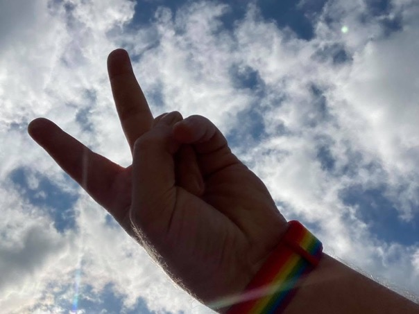
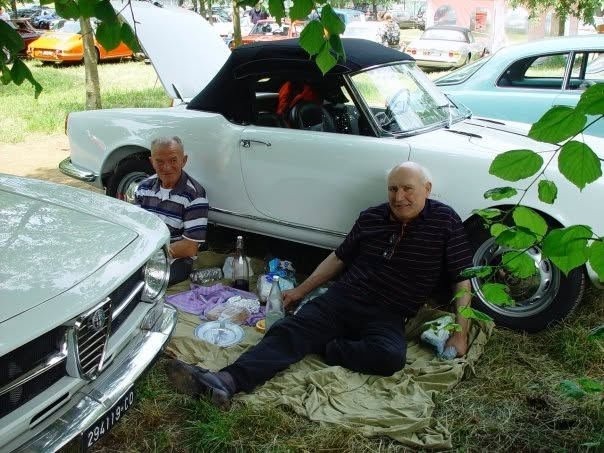

[🇦🇹 Deutsch](./bio-de.html) | [🇫🇷 Français](./bio-fr.html) | [🇮🇹 Italiano](./bio-it.html) | [🏴󠁧󠁢󠁥󠁮󠁧󠁿 English](./bio.html)

# 👤 Helmut 'Momo' Mombour

Bienvenue dans mon espace numérique. Je suis un voyageur passionné, un enthousiaste de l'open-source et un explorateur numérique. Connectez-vous avec moi via les plates-formes suivantes :

## 🌐 Connectez-vous avec moi

### 📘 [Facebook](https://www.facebook.com/hmo8020)

<table>
<thead><tr><th></th><th>Logo</th><th>Attitude</th></tr></thead>
<tbody>
<tr>
<td style="vertical-align: bottom;">Connectez-vous avec moi sur Facebook pour les mises à jour de voyage et les histoires de voyage.</td>
<td style="vertical-align: bottom;"></td>
<td style="vertical-align: bottom;"></td>
</tr>
</tbody>
</table>

### 𝕏 [Twitter](https://x.com/8020momo)
Suivez-moi sur Twitter pour des aperçus de voyage en temps réel et des réflexions quotidiennes.

### 💼 [LinkedIn](https://linkedin.com)
Réseau professionnel et parcours professionnel sur LinkedIn.

### 🏢 [Xing](https://xing.com)
Mon profil professionnel sur Xing.

### 📷 [Instagram](https://instagram.com)
Suivez mon voyage visuel de voyage et les moments en coulisses sur Instagram.

### 💬 [Telegram](https://t.me/momo72omom)
Rejoignez ma chaîne Telegram pour des guides de voyage exclusifs et des mises à jour.

### 🔒 [Signal](https://signal.me/#eu/Nwjv2kMT0lqlVeCiF5sjX8AuUKsnsuzN9nuSt3sY_VFfFOTgFrZDe4PA3imHHU6h)
Contactez-moi via Signal pour des conversations privées.

---

  
<em>Merci de vous connecter ! Explorons le monde ensemble.</em>

  
Fait avec ❤️ pour les voyageurs et les amateurs d'open-source

