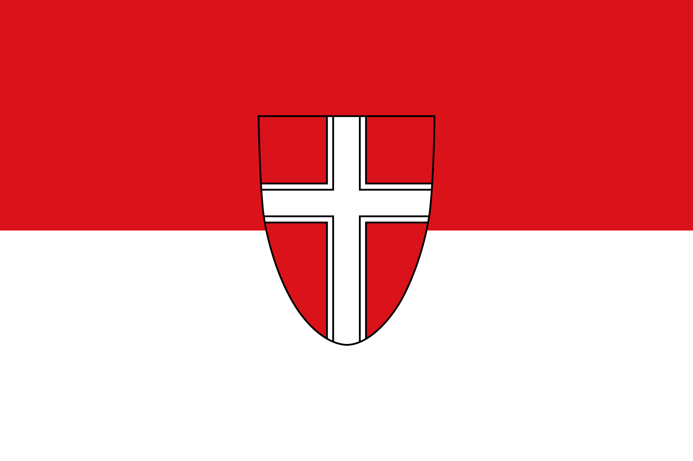

# 🇦🇹 La Mia Vienna
## Le Tue Guide Complete di Viaggio a Vienna, Austria

[🇦🇹 Deutsch](./wien-de.html) | [🇫🇷 Français](./wien-fr.html) | [🇮🇹 Italiano](./wien-it.html) | [🏴󠁧󠁢󠁥󠁮󠁧󠁿 English](./wien.html)

Benvenuti a **Mein Wien** - una guida di viaggio completa per una delle più belle, storicamente ricche e culturalmente vibranti città d'Europa. Vienna (Wien) ha affascinato i visitatori per secoli con i suoi palazzi imperiali, i musei di classe mondiale e la leggendaria cultura del caffè.

---

## 📜 Ieri è la Storia

La storia di Vienna si estende dai tempi romani come *Vindobona* attraverso la sua evoluzione in una delle capitali più potenti d'Europa. La città è diventata il centro dell'Impero austro-ungarico, una delle grandi potenze della storia che ha dominato vasti territori dal 16° al 20° secolo.

**Punti salienti storici chiave:**
- **Era romana**: Fondata come Vindobona (I secolo d.C.)
- **Assedio ottomano (1683)**: Un punto di svolta nella storia europea
- **Età dell'oro (18°-19° secolo)**: Ascesa al prominenza sotto la dinastia degli Asburgo
- **Congresso di Vienna (1815)**: Riformò l'Europa dopo Napoleone
- **Era austro-ungarica**: Centro di arte, musica e scambio intellettuale
- **Dopo la Prima Guerra Mondiale**: Transizione verso l'Austria moderna

L'architettura di Vienna riflette secoli di eredità imperiale – dalle chiese medievali ai palazzi barocchi ai magnifici edifici Art Nouveau (stile Secession).

---

## 🌟 Domani è un Mistero

Situata sul Danubio, Vienna affascina i visitatori con:

### 🏛️ **Attrazioni Iconiche**
- **Palazzo Schönbrunn**: Antica residenza estiva imperiale con splendidi giardini
- **Cattedrale di Santo Stefano (Stephansdom)**: Capolavoro gotico in piedi dal 1365
- **Palazzo Hofburg**: Residenza invernale storica degli imperatori austriaci
- **Ringstrasse**: Viale elegante fiancheggiato da istituzioni culturali

### 🎵 **Tesori Culturali**
- Opera di Stato di Vienna - leggendaria sede di musica classica
- Culla della musica classica (Mozart, Beethoven, Strauss)
- 100+ musei di classe mondiale (più pro capite di qualsiasi altra città europea)
- Vibrante scena d'arte e teatro

### ☕ **Esperienze Autentiche**
- Cultura del caffè viennese riconosciuta dall'UNESCO
- Tradizionali taverne Heuriger
- Mercati storici e pittoresche strade acciottolate
- Cucina viennese locale (Schnitzel, Sachertorte, Strudel)

---

## 🎁 Oggi è un Regalo - Fatti Divertenti

✨ **I Superlativi di Vienna:**

- **Città Più Vivibile**: Eletta più volte da The Economist Intelligence Unit
- **Capitale dei Musei**: Oltre 100 musei—più pro capite di qualsiasi altra città europea
- **Eredità Musicale**: Il Concerto di Capodanno dell'Orchestra Filarmonica di Vienna è trasmesso in 90+ paesi
- **Tesori UNESCO**: La cultura del caffè viennese è protetta come patrimonio culturale intangibile
- **Architettura Iconica**: La coloratissima Casa Hundertwasser dell'artista Friedensreich Hundertwasser
- **Monumenti Storici**: La Cattedrale di Santo Stefano ha sopravvissuto a guerre, incendi e rivoluzioni dal 1365
- **Ruota Gigante**: La famosa Ruota Gigante del Prater ha aperto nel 1766 e appare nel film "Il Terzo Uomo"
- **Produzione di Vino**: Una delle poche capitali europee che produce il proprio vino
- **Trasporti Pubblici**: Tra i migliori e più efficienti sistemi di trasporto d'Europa
- **Abitanti Celebri**: Sigmund Freud, Gustav Klimt e innumerevoli geni musicali

---

## 📅 Informazioni Pratiche

| Aspetto | Dettagli |
|---------|----------|
| **Posizione** | Nordest dell'Austria sul Danubio |
| **Popolazione** | ~1,9 milioni (città), ~2,9 milioni (area metropolitana) |
| **Lingua** | Tedesco (dialetto austriaco) |
| **Valuta** | Euro (€) |
| **Miglior Periodo di Visita** | Aprile–maggio o settembre–ottobre |
| **Trasporti** | Eccellenti trasporti pubblici, centro città a piedi |

---

## 🔗 Risorse

- **Wikipedia italiano**: [Vienna](https://it.wikipedia.org/wiki/Vienna)
- **Documentazione Completa**: [README del Progetto](./README.md)
- **Torna al Portfolio**: [← Torna alla Home](./)

---

  
<em>Esplora la bellezza, la storia e la cultura di Vienna.</em>

  
Fatto con ❤️ per i viaggiatori che scoprono la perla dell'Europa centrale

